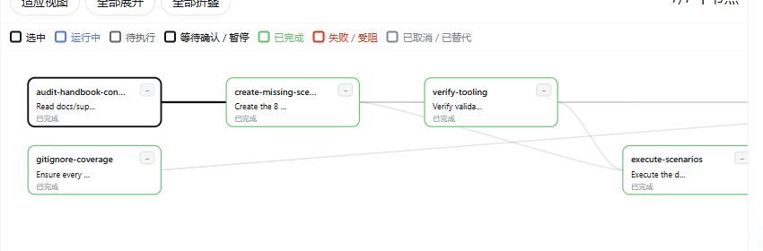

# Long Horizon Runtime · DSH 长任务插件

中文 | [English](README.en.md)

> 把一件很长的事，变成一条可确认、可跟踪、可恢复的任务。

[它解决什么问题](#它解决什么问题) · [快速开始](#快速开始) · [怎么使用](#怎么使用)

Long Horizon Runtime 是 [DeepSeek Harness](https://github.com/deepseek-harness/deepseek-harness) 的长任务插件。它适合研究、开发、排障、资料整理这类需要拆步骤、持续推进的工作：先看计划，确认后执行；过程随时可见，任务中断也能接着做。

## 它解决什么问题

|  | 普通对话 | 加上 Long Horizon Runtime |
| --- | --- | --- |
| 做一件复杂的事 | 过程都在聊天记录里 | 先给出一份可确认的任务计划，再按步骤推进 |
| 看进度 | 需要翻对话 | 在 Task Area 直接看任务步骤、依赖和当前状态 |
| 中途改变方向 | 重新描述需求，容易丢掉上下文 | 修改目标后保留已完成工作，再生成新的后续计划 |
| 对话被暂停或中断 | 需要自己找回进度 | 回到同一任务，继续未完成的步骤 |



## 快速开始

需要已安装 DeepSeek Harness，并能正常运行 `dsh web`。从 GitHub 安装还需要 Node.js `^22.19.0` 或 `>=24.0.0` 与 pnpm。

### 从 GitHub 安装

```bash
dsh plugin --profile web add github:ynymhrb/long-horizon-runtime#master
dsh web
```

### 安装本地检出

在仓库根目录执行：

```bash
dsh plugin --profile web add .
dsh web
```

## 怎么使用

不用切换模式，像平常一样说清楚你要完成的事。例如：

```text
研究 RAG 召回率的影响因素；拆成可验证的子任务，先给我计划，等我确认再执行。
```

插件会把它整理成一条长任务：

1. 给出分步骤的计划；
2. 你确认后开始执行；
3. 在 Task Area 中查看每一步的状态和结果；
4. 需要暂停、改目标或换一段对话时，继续同一个任务即可。

你也可以直接这样说：

```text
暂停 lt_abc123。
把 lt_abc123 的目标改为“只研究中文技术资料”。
继续 lt_abc123，告诉我还有哪些步骤没完成。
```
